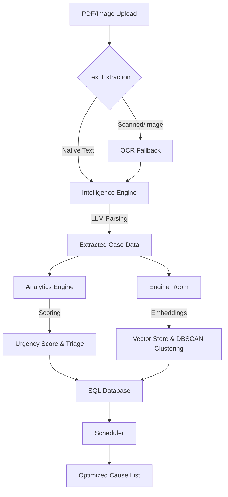

# 🏛️ Judicial AI — Court Case Backlog Prioritization Engine

**AI-Powered Court Case Backlog Prioritization, Semantic Clustering & Intelligent Scheduling Engine for the Indian Judiciary.**

> *"A state-of-the-art judicial decision support system featuring a premium glassmorphism dashboard, multi-provider LLM fallback (Ollama + Groq + HuggingFace), and automated OCR extraction."*

---

## 🚀 Key Features

- **💎 Premium Dashboard**: A modern, high-performance HTML/JS Single Page Application (SPA) with glassmorphism UI and interactive Chart.js analytics.
- **⚡ Groq Acceleration**: Ultra-fast legal document parsing using Groq (Llama 3.1) as the primary cloud LLM provider.
- **🔄 Multi-Provider Fallback**: Intelligent fallback chain (Ollama ⮕ Groq ⮕ HuggingFace) ensures the system stays online even if a service fails.
- **🔍 Robust OCR Extraction**: Automatic fallback to Tesseract OCR for scanned/image-based PDF documents.
- **📑 Semantic Clustering**: Groups similar cases based on semantic legal questions to optimize judicial time and enable batch hearings.
- **📅 Optimized Cause List**: Daily hearing schedule generated based on priority, humanitarian triage, and adjournment risk.

---

## 🎨 Premium Dashboard Features

The new standalone dashboard provides a high-end experience for judicial officers:
- **Glassmorphism UI**: A sleek, translucent design system for focus and clarity.
- **Interactive Analytics**: Real-time charts showing backlog trends and case types.
- **Bulk Intake Zone**: Drag-and-drop multiple legal documents for parallel processing.
- **Semantic Cluster Cards**: Visualize related cases grouped by legal similarity.
- **Auto-Refreshing Cause List**: Optimized schedule that updates as new cases are processed.

---

## 📊 Data Flow & AI Pipeline

How a legal document transforms from a raw PDF into an optimized cause list:



### **Step-by-Step Processing:**

1.  **Ingestion & OCR**: When you upload a PDF, the `Intelligence Engine` first attempts to pull native text. If it's a scanned FIR or petition, it automatically triggers **Tesseract OCR** to "read" the images.
2.  **LLM Legal Parsing**: The extracted text is sent to the LLM (Groq/Ollama). It identifies the Case Title, Petitioner/Respondent, Case Type, and generates a concise legal summary.
3.  **Multi-Dimensional Scoring**: The `Analytics Engine` evaluates the extracted data to calculate an **Urgency Score (0-100)** and flags humanitarian concerns (e.g., undertrials, senior citizens).
4.  **Semantic Vectorizing**: The `Engine Room` converts the case summary into a mathematical vector (embedding) and stores it in **ChromaDB**.
5.  **DBSCAN Clustering**: The system analyzes the vectors to find cases with identical legal questions and groups them into **Semantic Clusters** for batch hearings.
6.  **Intelligent Scheduling**: The `Scheduler` pulls the prioritized and clustered cases to generate a daily **Cause List**, ensuring high-priority cases are heard first.

---

## 📂 Simplified Project Structure

```
court_ai_judiciary/
├── app/                        # FastAPI Backend
│   ├── database/               # Database connection (SQLite/Chroma)
│   ├── models/                 # SQLAlchemy Data Models
│   ├── routes/                 # Clean API Endpoints
│   └── main.py                 # FastAPI Entry Point
├── core/                       # The Intelligence Engine
│   ├── intelligence.py         # LLM Parsing & OCR Extraction
│   ├── analytics.py            # Urgency Scoring & Adjournment Prediction
│   ├── engine.py               # Vector Store, Embeddings & Clustering
│   └── scheduler.py            # Optimized Cause List Generation
├── dashboard/                  # Frontend Assets
│   └── static/                 # Premium HTML/CSS/JS SPA
├── data/                       # Local Data Persistence
├── run.py                      # Unified Platform Runner
└── requirements.txt            # System Dependencies
```

---

## 🛠️ Tech Stack

| Layer | Technology |
|---|---|
| **Core LLM** | Llama 3.1 via **Groq** / **Ollama** |
| **Cloud Fallback** | Mistral 7B via **HuggingFace** |
| **Embeddings** | **Sentence Transformers** (MiniLM-L6) |
| **Vector DB** | **ChromaDB** |
| **OCR / Docs** | **Tesseract** + **PDFPlumber** |
| **Backend** | **FastAPI** |
| **Dashboard** | **HTML5 / Vanilla CSS / Chart.js** |
| **Optimization** | **DBSCAN** Clustering + Heuristic Scheduling |

---

## 🏁 Quick Start

### Prerequisites
- Python 3.10+
- Tesseract OCR: `brew install tesseract` (macOS)
- (Optional) [Ollama](https://ollama.ai/) for local LLM execution

### 1. Install Dependencies
```bash
pip install -r requirements.txt
```

### 2. Configure Environment
Add your API keys to `.env`:
```bash
HUGGINGFACE_API_KEY=hf_...
GROQ_API_KEY=gsk_...
CHROMA_API_KEY=ck-...
```

### 3. Launch the Platform
```bash
python run.py
```

- 📊 **Dashboard**: http://localhost:8000
- 📡 **API Docs**: http://localhost:8000/docs

---

## 🔑 Key API Endpoints

| Method | Endpoint | Description |
|---|---|---|
| `POST` | `/api/v1/upload/` | Upload single FIR / Petition |
| `POST` | `/api/v1/upload/bulk` | Bulk upload multiple PDF documents |
| `GET` | `/api/v1/cases/` | Get prioritized case list |
| `POST` | `/api/v1/cases/cluster` | Refresh semantic case clusters |
| `POST` | `/api/v1/schedule/generate` | Generate optimized daily cause list |
| `GET` | `/api/v1/analytics/backlog` | Dashboard aggregate statistics |
