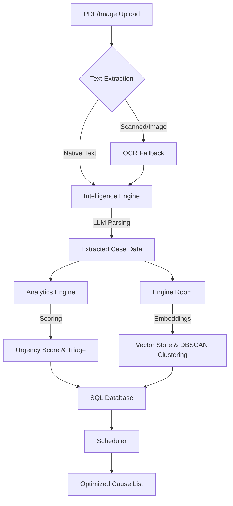

# Judicial AI - Court Case Backlog Prioritization Engine

A decision support system for prioritizing court case backlogs, semantic clustering, and scheduling for the Indian judiciary. It features a Streamlit dashboard, multi-provider LLM integration (Ollama, Groq, Hugging Face) with fallback, and automated OCR extraction.

---

## Key Features

- **Prioritized Registry Dashboard**: An interactive Streamlit dashboard for visualizing and managing case queues.
- **Groq Acceleration**: Fast legal document parsing utilizing Groq Llama 3.1 as the primary LLM provider.
- **Multi-Provider Fallback**: Fallback chain (Ollama -> Groq -> HuggingFace) ensuring high availability.
- **Robust OCR Extraction**: Automatic fallback to Tesseract OCR for scanned and image-based PDF documents.
- **Semantic Clustering**: Groups similar cases based on semantic legal questions to optimize judicial scheduling and enable batch hearings.
- **Optimized Cause List**: Daily hearing schedule generated based on priority, humanitarian factors, and adjournment risk.

---

## Operational Prioritization Dashboard

The dashboard provides a decision-support workspace for judicial officers:
- **Aesthetic Metrics**: High-fidelity operational KPIs for at-a-glance status checks.
- **Priority Heatmap**: Scatter plot mapping Urgency vs. Legal Impact/Complexity, with hash-based coordinate jittering for overlap resolution.
- **Ranked Priority Table**: Selected case breakdown matching Case Registry metrics.
- **Alerts and Actions**: Contextual alerts and recommended actions to triage humanitarian cases and optimize scheduling.

---

## Data Flow & AI Pipeline

How a legal document transforms from a raw PDF into an optimized cause list:



### **Step-by-Step Processing:**

1.  **Ingestion & OCR**: When a PDF is uploaded, the `Intelligence Engine` first attempts to pull native text. If it is a scanned file, it automatically triggers **Tesseract OCR** for processing.
2.  **LLM Legal Parsing**: The extracted text is parsed by the LLM (Groq/Ollama) to identify Case Title, Petitioner/Respondent, Case Type, and generate a concise legal summary.
3.  **Multi-Dimensional Scoring**: The `Analytics Engine` evaluates the extracted data to calculate an **Urgency Score (0-100)** and flags humanitarian concerns (e.g., undertrials, senior citizens).
4.  **Semantic Vectorizing**: The `Engine Room` converts the case summary into a vector (embedding) and stores it in **ChromaDB**.
5.  **DBSCAN Clustering**: The system analyzes the vectors to find cases with high semantic similarity and groups them into **Semantic Clusters** for batch hearings.
6.  **Intelligent Scheduling**: The `Scheduler` pulls prioritized and clustered cases to generate a daily **Cause List**, ensuring high-priority cases are heard first.

---

## Project Structure

```
court_ai_judiciary/
├── app/                        # FastAPI Backend
│   ├── database/               # Database connection (SQLite/Chroma)
│   ├── models/                 # SQLAlchemy Data Models
│   ├── routes/                 # Clean API Endpoints
│   └── main.py                 # FastAPI Entry Point
├── core/                       # Core Analytics & Intelligence
│   ├── intelligence.py         # LLM Parsing & OCR Extraction
│   ├── analytics.py            # Urgency Scoring & Adjournment Prediction
│   ├── engine.py               # Vector Store, Embeddings & Clustering
│   └── scheduler.py            # Optimized Cause List Generation
├── frontend/                   # Streamlit Frontend Dashboard
│   └── app.py                  # Main Streamlit Application
├── data/                       # Local Data Persistence
├── run.py                      # Unified Platform Runner
└── requirements.txt            # System Dependencies
```

---

## Tech Stack

| Layer | Technology |
|---|---|
| **Core LLM** | Llama 3.1 via **Groq** / **Ollama** |
| **Cloud Fallback** | Mistral 7B via **HuggingFace** |
| **Embeddings** | **Sentence Transformers** (MiniLM-L6) |
| **Vector DB** | **ChromaDB** |
| **OCR / Docs** | **Tesseract** + **PDFPlumber** |
| **Backend** | **FastAPI** |
| **Dashboard** | **Streamlit** |
| **Optimization** | **DBSCAN** Clustering + Heuristic Scheduling |

---

## Quick Start

### Prerequisites
- Python 3.10+
- Tesseract OCR: `brew install tesseract` (macOS)
- (Optional) Ollama for local LLM execution

### 1. Install Dependencies
```bash
pip install -r requirements.txt
```

### 2. Configure Environment
Add your API keys to `.env`:
```bash
HUGGINGFACE_API_KEY=hf_...
GROQ_API_KEY=gsk_...
CHROMA_API_KEY=ck-...
```

### 3. Launch the Platform
```bash
python run.py
```

- **Dashboard**: http://localhost:8501
- **API Docs**: http://localhost:8000/docs

---

## Key API Endpoints

| Method | Endpoint | Description |
|---|---|---|
| `POST` | `/api/v1/upload/` | Upload single FIR / Petition |
| `POST` | `/api/v1/upload/bulk` | Bulk upload multiple PDF documents |
| `GET` | `/api/v1/cases/` | Get prioritized case list |
| `POST` | `/api/v1/cases/cluster` | Refresh semantic case clusters |
| `POST` | `/api/v1/schedule/generate` | Generate optimized daily cause list |
| `GET` | `/api/v1/analytics/backlog` | Dashboard aggregate statistics |
